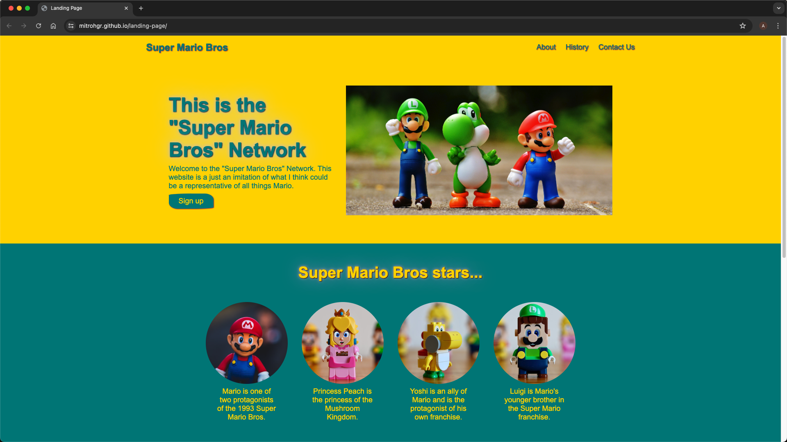
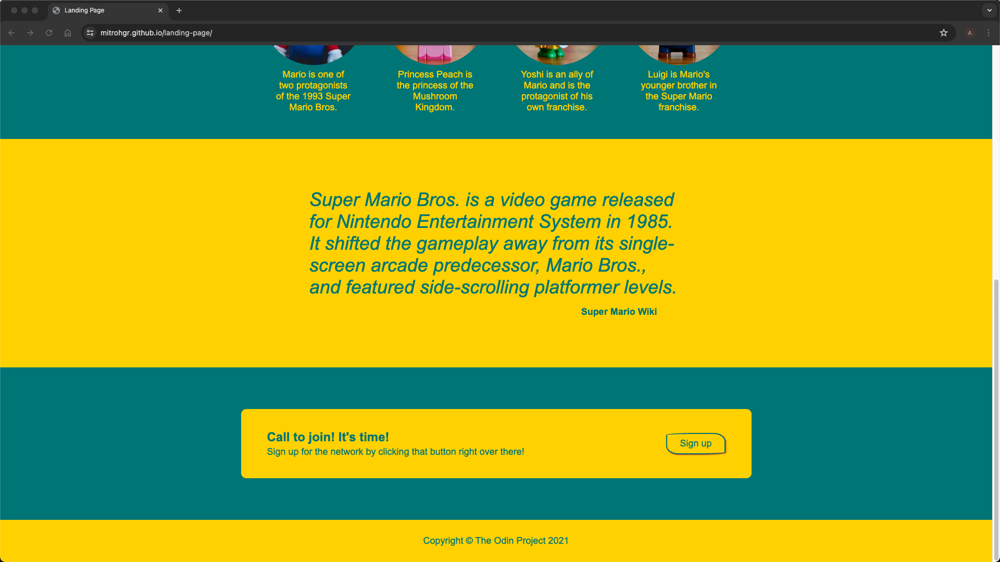

# landing-page
An Entire Web Page from a Design

## Demo

## Status

***This project will no longer be worked upon.***

This is because the [Learning to Code](https://dev.to/theodinproject/learning-code-f56) section of the [Becoming a TOP Success Story](https://dev.to/i3uckwheat/series/16683) makes it clear to [only focus on the point of the assignment](https://dev.to/theodinproject/learning-code-f56) and that [foundations isn't a strong portfolio generator](https://dev.to/theodinproject/learning-code-f56).

## General Info

**landing-page** is the [second project](https://www.theodinproject.com/lessons/foundations-landing-page) from the [Foundations Course](https://www.theodinproject.com/paths/foundations/courses/foundations) in [The Odin Project](https://www.theodinproject.com/about).

Here, I create an entire web page from a given design of a landing page. The design comes in the form of 2 images: one is an image of the complete website and the other has some details about some of the fonts and colors used. Finally, I substitute my own content into this design by personalizing the page using actual images, colors, and font.

## Screenshots

## Technologies

+ ***CLI***
+ ***Git***
+ ***GitHub***
+ ***HTML***
+ ***GitHub Pages***
+ ***CSS***

## Self-reflections

> I learned quite a lot of things here: use of flexbox to arrange items in rows or columns, growing and shrinking using different flex behaviors, taking account of the main and cross axis (or their ramifications when flex-direction is changed), and various alignment plus gap properties to get the required layout.

> [!NOTE]
> Two things that gave me a problem were the following: firstly, just like in the [previous project](https://github.com/mitrohgr/odin-recipes), I kept using "weight" instead of "width" but luckily the [markup validation service](https://validator.w3.org/#validate_by_input) caught the errors at the very end; secondly, I had a few problems with flex-wrap and wrapping (like resizing when I reduced the screen size) the containers as required in the design image and this was overcome through [googling](https://www.google.com/) and "[stackoverflow](https://stackoverflow.com/)-ing" for specific search terms.

## Acknowledgements

+ *Credit* for the ***images*** are as follows:
  + [Alexas_Fotos](https://pixabay.com/users/alexas_fotos-686414/) for the [Banner image](https://pixabay.com/photos/mario-luigi-yoschi-characters-fun-1557240/).
  + [Boukaih](https://unsplash.com/@boukaih) for the [Mario image](https://unsplash.com/photos/super-mario-in-blue-and-red-shirt-figurine-2AsfYaYTbpI).
  + [Taha](https://unsplash.com/@exploringzhongguo) for the [Luigi image](https://unsplash.com/photos/a-toy-figure-of-a-man-with-a-green-hat-r0DAP0V72Uc), the [Yoshi image](https://unsplash.com/photos/a-lego-toy-of-a-man-holding-a-gun-34iMRP0r85s), and the [Princess Peach image](https://unsplash.com/photos/a-lego-figure-of-a-woman-with-a-crown-on-her-head-LFmQs9EBVJ0).

## Contact and Support

+ Feel free to contact ***mitrohgr_03505*** for project-related queries.
+ No further feature modifications or improvements will be done to this project.
